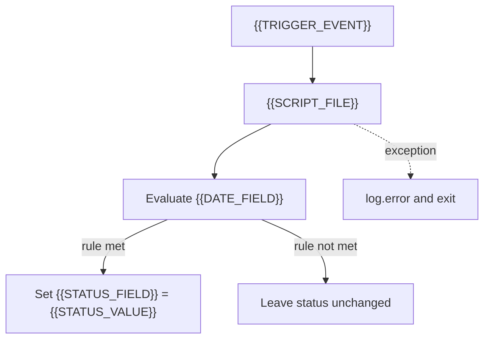

# Technical Design Document Template

> Source structure from `TER - Technical Design Document.docx` (Office original retained).  
> Replace `{{PLACEHOLDER}}` values. Screenshots/images are omitted from the Markdown conversion.

**Client:** `{{CLIENT_NAME}}`  
**Feature:** `{{FEATURE_NAME}}`  
**Date:** `{{DOC_DATE}}`  
**Author:** `{{AUTHOR}}`  
**Script file:** `{{SCRIPT_FILE}}`  
**Record type:** `{{RECORD_TYPE}}`

---

## TDD_01 Purpose — Functional

Summarize the business process and why custom scripting is required.

{{PURPOSE}}

Document the process clearly (add screenshots in the Word original if needed for client delivery).

---

## TDD_02 Solution Overview — Technical

### 02.01 Objective

{{OBJECTIVE}}

### 02.02 Design

{{DESIGN_SUMMARY}}

| Item | Value |
|---|---|
| Script type | `{{SCRIPT_TYPE}}` |
| Entry point | `{{TRIGGER_EVENT}}` |
| Date field | `{{DATE_FIELD}}` |
| Status field | `{{STATUS_FIELD}}` |
| Status value when rule met | `{{STATUS_VALUE}}` |

---

## TDD_03 Solution Assumptions — Technical

{{ASSUMPTIONS}}

---

## TDD_04 Automations — Technical

{{AUTOMATIONS}}

---

## TDD_05 Feature Design — Technical

{{FEATURE_DESIGN}}

Acceptance criteria:

{{ACCEPTANCE_BULLETS}}

---

## TDD_06 Script Deployment — Technical

{{DEPLOYMENT_NOTES}}

Suggested path:

`src/FileCabinet/SuiteScripts/Terillium/integrations/{{FEATURE_SLUG}}/{{SCRIPT_FILE}}`

---

## TDD_07 Authorization — Management

| Field | Value |
|---|---|
| Change Request ID | `{{CR_ID}}` |
| Change Request Name | `{{CR_NAME}}` |
| Date Submitted | `{{CR_DATE}}` |
| Submitted By | `{{CR_SUBMITTER}}` |
| Priority | High / Medium / Low |
| Scope / impacts | `{{CR_SCOPE}}` |
| Schedule / effort | `{{CR_EFFORT}}` |

---

## Technical diagram (Mermaid)

