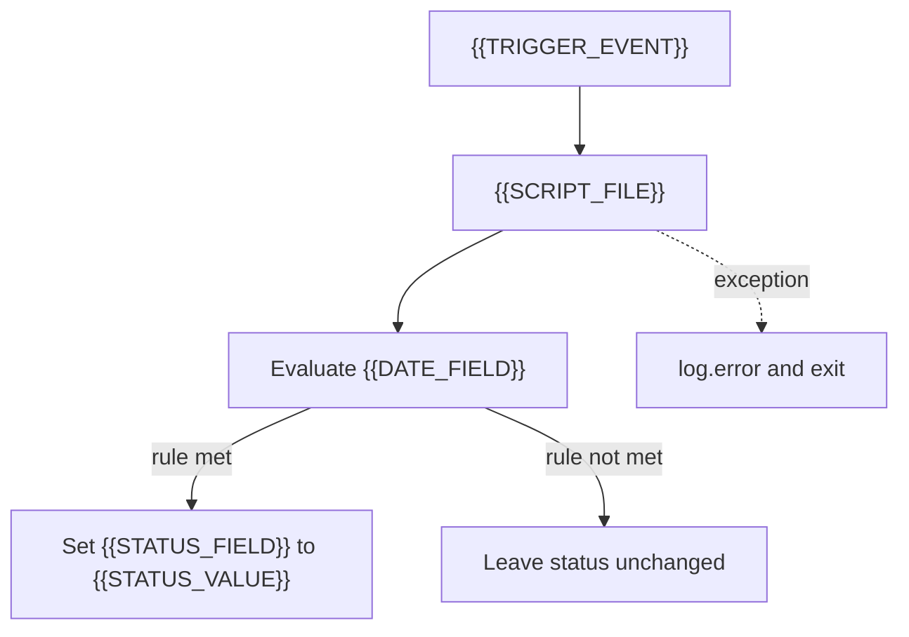

# Technical Diagram Template

> Companion to `TECHNICAL-DESIGN.md`. Source: TER Technical Design Document structure.

**Feature:** `{{FEATURE_NAME}}`  
**Script:** `{{SCRIPT_FILE}}`  
**Record:** `{{RECORD_TYPE}}`

## Flow

## Legend

| Symbol | Meaning |
|---|---|
| Trigger | `{{TRIGGER_EVENT}}` |
| Script | `{{SCRIPT_FILE}}` |
| Date field | `{{DATE_FIELD}}` |
| Status field | `{{STATUS_FIELD}}` → `{{STATUS_VALUE}}` |

## Deployment notes

- Script type: `{{SCRIPT_TYPE}}`
- Deployment / audience: `{{DEPLOYMENT_NOTES}}`
- Assumptions: `{{ASSUMPTIONS}}`
